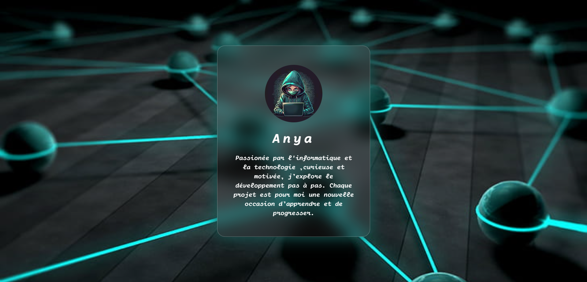

# 🌸 Glassmorphism Project

Un petit projet d’entraînement au **Glassmorphisme** (effet verre) en HTML & CSS.  
Ce projet affiche une **carte de profil** avec un effet moderne de transparence et de flou.

---

## 🚀 Live Demo

👉 [Voir la page en ligne](https://anya-git.github.io/Glassmorphism/)

---

## 📂 Repository

👉 [Accéder au repo GitHub](https://github.com/AnYa-git/Glassmorphism.git)

---

## ✨ Aperçu

- Effet **glassmorphisme** avec `backdrop-filter`
- Carte de profil centrée avec image, titre et description
- Utilisation d’une **police personnalisée**
- Fond avec **image de background**

---

## 🛠️ Technologies utilisées

- **HTML5**
- **CSS3**
- Font-face personnalisé

---

## 📸 Screenshot

## 

## 📚 Objectif

Apprentissage et pratique des bases de l’intégration web :

- Centrage avec **Flexbox**
- Mise en page responsive simple
- Application d’effets modernes en CSS

---

✍️ Créé avec ❤️ par **Anya**
